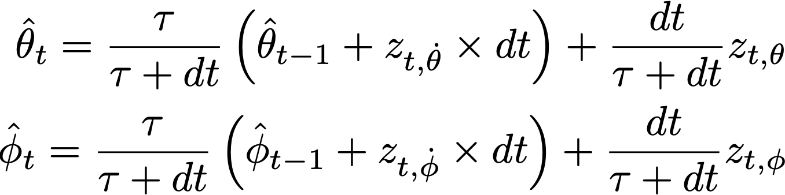
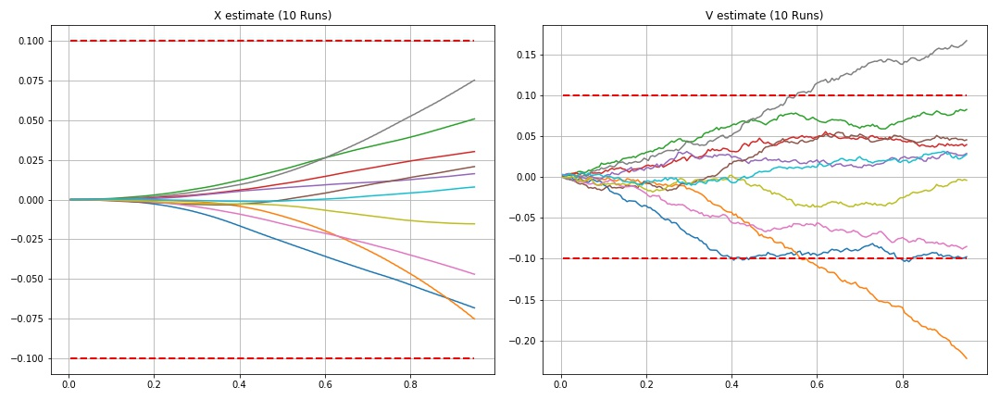

# FCND-3D-Estimation
The goal of this project is develop the estimation part of the controller with the help of a the CPP simulator. A succesful implementation would see the controller and the estimation blocks work together to make the drone fly as intended. Essentially we are going to use various sensor measurements from IMU units to have a better estimation of the position, velocity and yaw angle.
## Simulator and C++ Implementation
Most of the code in this project can be found in [FCND-Estimation-CPP](https://github.com/bwassim/FCND-3D-Estimation/tree/master/FCND-Estimation-CPP/src) folder. We have already worked on the controller part in previous project and the implementation can be found here [src/QuadControl.cpp](https://github.com/bwassim/FCND-3D-Quadrotor-Controller/tree/master/FCND-Controls-CPP/src). All the configuration files for the controller and the vehicle are in the `config` directory. 
Some function in [QuadEstimatorEKF.cpp](https://github.com/bwassim/FCND-3D-Estimation/blob/master/FCND-Estimation-CPP/src/QuadEstimatorEKF.cpp) needs to be complemented.

The tunning parameters for the controller are given for this project in  [QuadControlParams.txt](https://github.com/bwassim/FCND-3D-Estimation/blob/master/FCND-Estimation-CPP/config/QuadControlParams.txt), however note that we still need to complete this project with our previously tunned parameters in the control project to succesfully meet the requirements.
The tunning parameters for the estimation project can found in [QuadEstimatorEKF.txt](https://github.com/bwassim/FCND-3D-Estimation/blob/master/FCND-Estimation-CPP/config/QuadEstimatorEKF.txt)
### Prerequisites
If you are using a mac, Xcode would be enough to run the project. Otherwise follow the prerequisites in the seed project's [README](https://github.com/udacity/FCND-Estimation-CPP)

## The tasks
In order to complete the building of the estimator, we need to go through and complete the following steps 

* Step 1: Sensor Noise
* Step 2: Attitude Estimation
* Step 3: Prediction Step
* Step 4: Magnetometer Update
* Step 5: Closed Loop + GPS Update
* Step 6: Adding Your Controller

### Step 1: Sensor Noise 

In this section, we the sensor noise deviation for the GPS x signal and the IMU accelerometer x signal logs and compute the standard deviation of each signal.
The calculations and results are in this [jupyter notebook ](https://github.com/bwassim/FCND-3D-Estimation/tree/master/FCND-Estimation-CPP/jupyter-notebook)


`
PASS: ABS(Quad.GPS.X-Quad.Pos.X) was less than MeasuredStdDev_GPSPosXY for 68% of the time 
PASS: ABS(Quad.IMU.AX-0.000000) was less than MeasuredStdDev_AccelXY for 69% of the time`

### Step2: Attitude Estimation 
In this section we need to improve the complementary attitude filter. Currently a linearized version based on a small angle approximation is implemented. The integrated (predicted) value is then updated in a complementary filter style with attitude information from accelerometers.
`We basically need to update the attitude estimation with the real nonlinear model instead of the linearized one`. 
To do this we just need to convert the body rates angles p, q, r we obtain from the gyro to angular velocities in the intertial frame. We have already used this transformation in the previous control project. as a reminder we proceed with the following transformation 


The predicted pitch and predicted roll are now updated with respect to the transformed gyro angles. The Roll and Pitch angles are derived from the accelerometer. The general expression to calculate the complementary filter remains the same 



With the previous transformation we obtain the result in the following animation 


### Step3: Prediction Step
Run scenario 08_PredictState. This scenario is configured to use a perfect IMU (only an IMU). Due to the sensitivity of double-integration to attitude errors, we've made the accelerometer update very insignificant (QuadEstimatorEKF.attitudeTau = 100). The plots on this simulation show element of your estimated state and that of the true state. At the moment you should see that your estimated state does not follow the true state.

In this section we want to initially implement the prediction step of our EKF filter. The state prediction step is implemented in [FCND-Estimation-CPP/src/QuadEstimatorEKF::PredictState](https://github.com/bwassim/FCND-3D-Estimation/blob/aab30c1da582a3c4dd4f18ce0e2efd2ca8373f50/FCND-Estimation-CPP/src/QuadEstimatorEKF.cpp#L179-L185). It can observed from the simulation below that the estimated state tracks the actual state with small error. 


The previous simulation used a perfect IMU. This time we would like to introduce some realistic IMU by introducing some noise.



One can see that the value of sigma in both graphs is constant and does not change with time. It is expected since we have not implemented the part of the EKF that updates the covariance matrix, and that's what needs to be done. 
* First  I will calculate the partial derivative of the body-to-global rotation matrix in the function `GetRbgPrime()`. 
* Once we have that function implemented, we need to complete the rest of the prediction step (predict the state covariance forward) in `Predict()`. After completing the covariance update in [FCND-Estimation-CPP/src/QuadEstimatorEKF::Predict](https://github.com/bwassim/FCND-3D-Estimation/blob/85dcdc7bc56e1c57b244cb95e3df4c3fe403ada7/FCND-Estimation-CPP/src/QuadEstimatorEKF.cpp#L265-L282), we obtain the following simulation 


Note that we have decreased the standard deviation for `QVelXYStd` to capture closely the magnitude of the error.

### Step 4: Magnetometer Update
Up until now we have only used the acceloremeter and gyro for our state estimation. In this section, we will be adding the information from the magnetometer to improve the the filter's heading precision. The yaw update given the sensor measurement is implemented in [FCND-Estimation-CPP/src/QuadEstimatorEKF::UpdateFromMag](https://github.com/bwassim/FCND-3D-Estimation/blob/1110cb2a3c17768b815d3f4cd5733218946d914d/FCND-Estimation-CPP/src/QuadEstimatorEKF.cpp#L324-L333). 


Note that our error is less that 0.1 rad in heading for at least 10 seconds as required.

### Step5: Closed Loop + GPS Update


In this section we make sure we are using realistic IMU by commenting out the lines in `config/11_GPSUpdate.txt:
```
#SimIMU.AccelStd = 0,0,0
#SimIMU.GyroStd = 0,0,0
```
We implement the EKF GPS Update in the function [FCND-Estimation-CPP/src/QuadEstimatorEKF::UpdateFromGPS](https://github.com/bwassim/FCND-3D-Estimation/blob/e44270fc01ab9a5ea1f9a86aa67bdb8c9ef97a9a/FCND-Estimation-CPP/src/QuadEstimatorEKF.cpp#L303-L317).
It can be observed that the estimation position error is < 1m. We have tweaked a little some parameters in the GPS measurements std deviation to get better result. 

### Step 6: Adding Your Controller
Up to this point, we have been working with a controller that has been relaxed to work with an estimated state instead of a real state. So now, we will use our previsouly implemented controller. So we need to :
* Replace QuadController.cpp with the controller you wrote in the last project.
* Replace QuadControlParams.txt with the control parameters you came up with in the last project.
The goal is to once again complete the entire simulation cycle with an estimated position error of < 1m.


The simulation above shows the result of the full controller/estimator implementation. The control parameters used in the previous project was good enough to produce the simulation above.